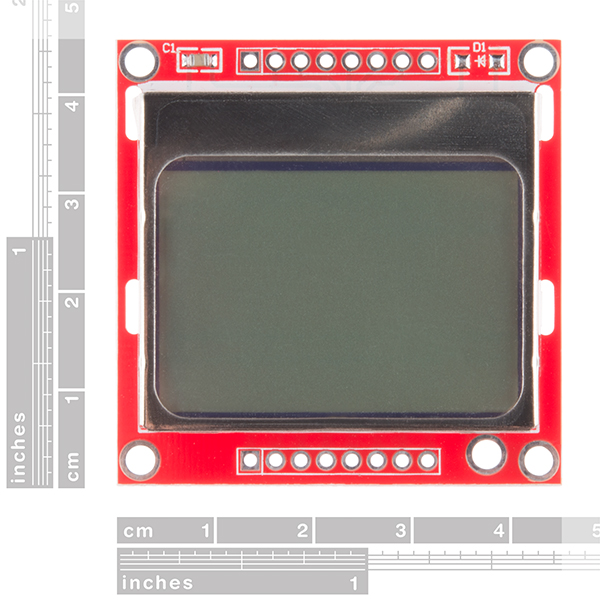

This is my open source arduino projector. I was so excited to discover it that I haven't even tested it yet!
I bought a spotlight to make a black light out of.I realized that the tiny led and the convex lens would make a projector.
This is just a rough test design. I didn't get it done for halloween because I figured it out less than 2 days before.
Where do ideas come from anyways?
Enjoy.

I used the very popular nokia 5510 lcd.You have to use one that can have a big rectangle cut in the pcb so the light shines through it.
Then you put it in front of the lens and let the led shine through. You can figure the wiring out from the code but remember to use a
 voltage converter like a diode and resistor for the data lines because they are 3v.
 
 It's very rough but it gets me in the "idea space". 
 
 The sketch just flips through the images right now. I will add an sd card and other featues later.
 
 the rotate.html file has javascript I used to convert a binary image to the nokia format it's rough but it works.
 
 Here is the spotlight I have.
 

 
 Here is the lcd module. It's very popular. you can cut a rectangle the size of the lcd in this one.
 

 I'm using my favorite construction technique. modules pushed through perfboard with wire wrap. See my other projects for an example.
 
 improvements to come...
